# blockchain-revenue-distribution-center

这是一个围绕“创作者月度结算与链上自动分账”构建的 `Next 业务型 + Ponder 索引分支` 链上演示。  
它不处理原始广告日志，而是把平台月度结算后的最终结果做成可领取账单，再由合约以 Anvil 原生 `ETH` 完成链上 `claim` 和协作者自动分账。

## 项目定位

- 用户表层体验是“账单、领取、分账、流水”，不是协议控制台。
- 架构采用 `Next.js App Router + TypeScript + wagmi + viem`。
- 链上事件索引从 `v1` 开始纳入 `Ponder + PGlite`，但私有账单源数据仍然只保留在 `frontend/server-data/`。
- `/platform` 只做演示控制台，不扩展成完整平台后台。
- `/ledger` 以当前钱包的个人明细延伸为主，不做纯公开透明公告板。

## 核心功能

- 平台单笔激活月度批次：点击“保存并激活”时，同步写入 `batchId / merkleRoot / metadataHash` 并注入当月等额 `ETH`。
- 月份锁定：同一月份只允许录入一次，激活后不能补资或重设。
- 创作者查看账单：前端展示本月账单摘要、分账预览、当前状态。
- 单笔领取：创作者发起一笔必要交易完成本月收益领取。
- 自动分账：同一笔 `claim` 交易内将原生 `ETH` 发送给创作者和 2 个协作者。
- 历史记录：创作者页和流水页展示历史 `claim` 与到账记录。
- 平台动作：平台页支持激活、恢复、暂停、关闭当前批次。
- 本地索引：`services/indexer/` 内的 Ponder 负责链上读模型和后续扩展空间。

## 角色与核心对象

### 角色

- `platform`：平台结算方，预览并激活当月或未来月份批次。
- `creator`：创作者，查看账单与领取收益。
- `collaborator`：被动收款协作者，在分账规则快照中出现。

### 核心对象

- `RevenueBatch`
- `CreatorSettlementBill`
- `CreatorClaimPackage`
- `SplitRuleSnapshot`
- `ClaimRecord`
- `SplitPaymentRecord`

## 业务主流程

1. 平台在链下生成月度账单和单创作者 `Merkle` 输入。
2. 平台在 `/platform` 预览月份数据，并通过一笔“保存并激活”交易完成批次发布和等额资金上链。
3. 创作者在收益中心查看账单摘要和分账预览。
4. 创作者发起一笔 `claim` 交易。
5. `CreatorRevenueDistributor` 校验批次、proof 和重复领取状态。
6. 合约自动把原生 `ETH` 分到创作者与协作者。
7. 前端与索引层同步展示领取记录和到账明细。


## demo

### 四种不同的角色
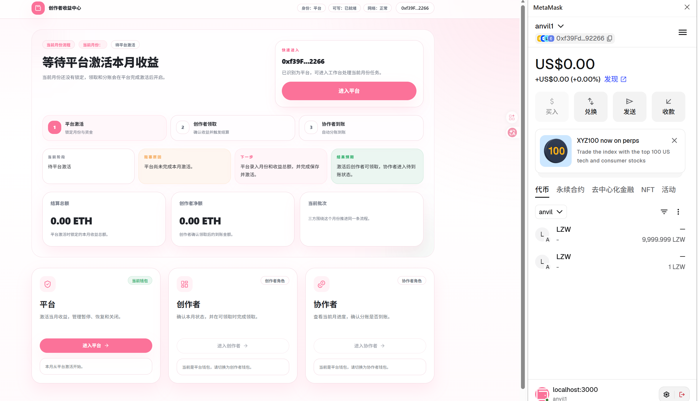


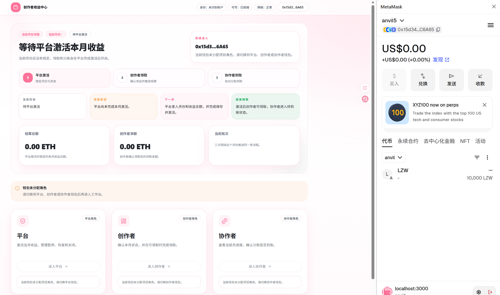
### 平台方激活创作方当月的revenue，本地链上查询（foundry）
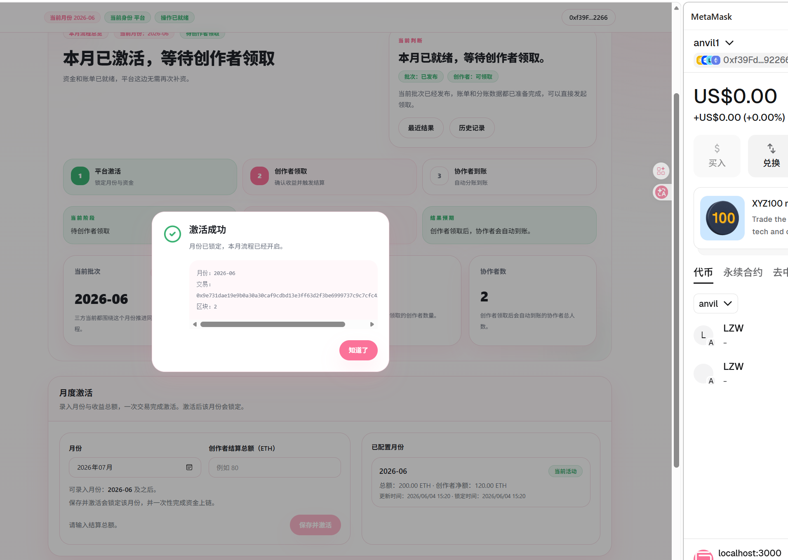
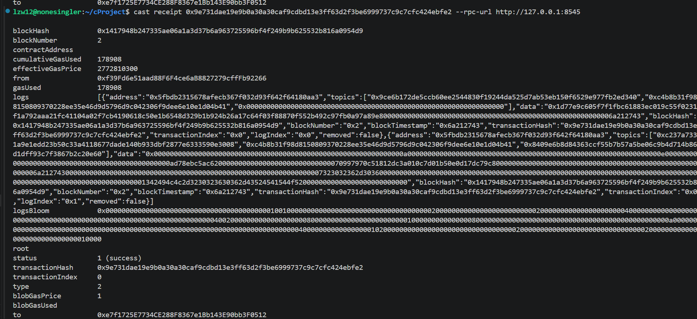
### 创作方领取收益，并签名
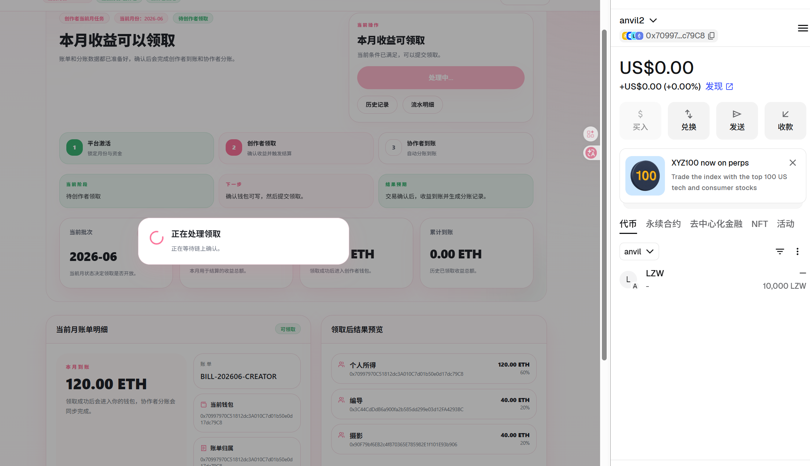
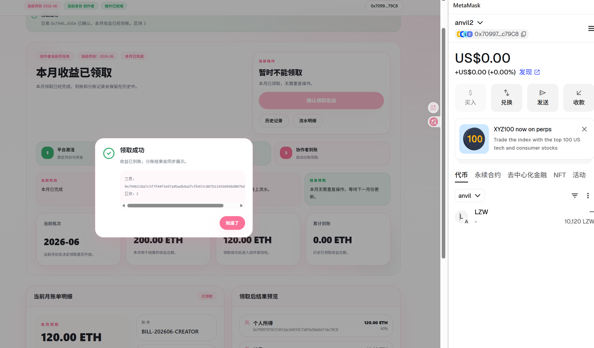
### 协作者无需任何操作，待创作方领取后，会按预前敲定的收益分成自动分发
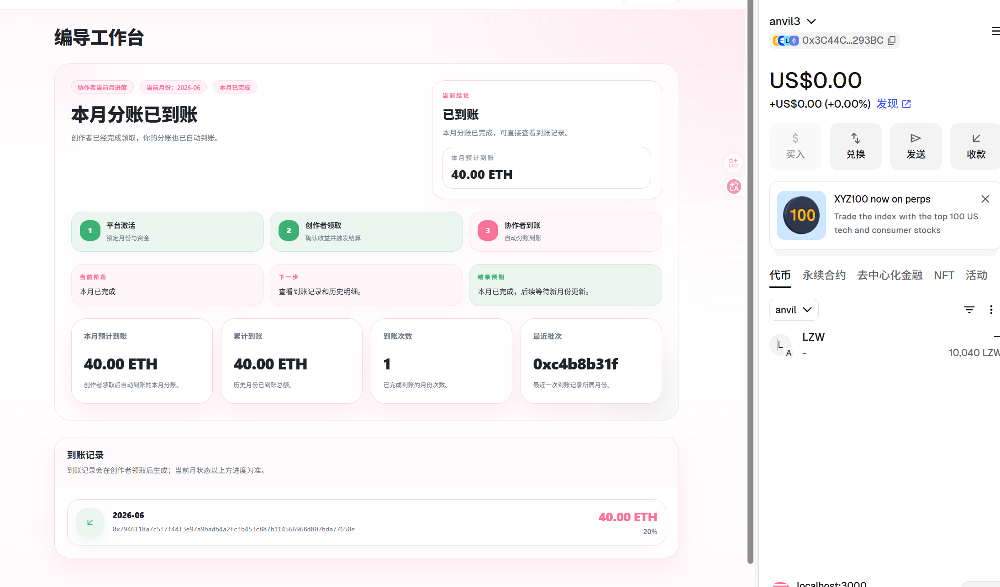
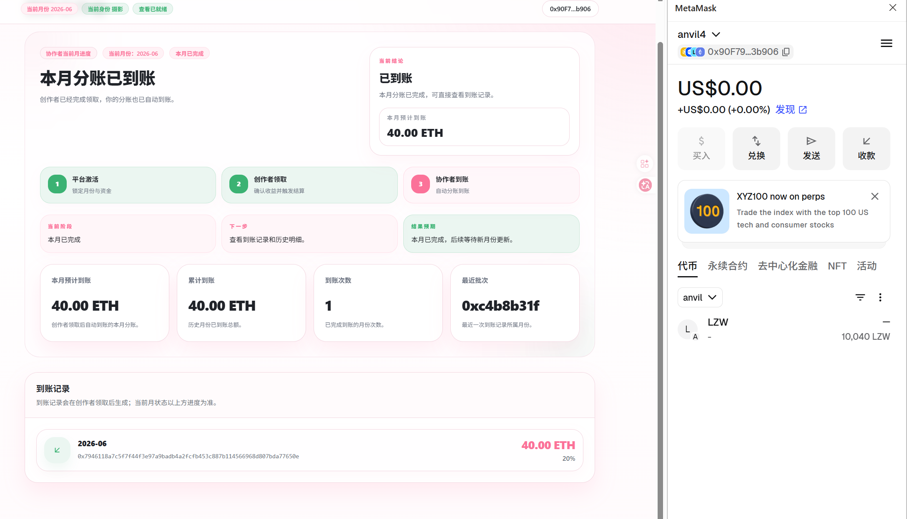
### 为了模拟多个月份的历史记录查询，提前发放7月份和8月份的revenue
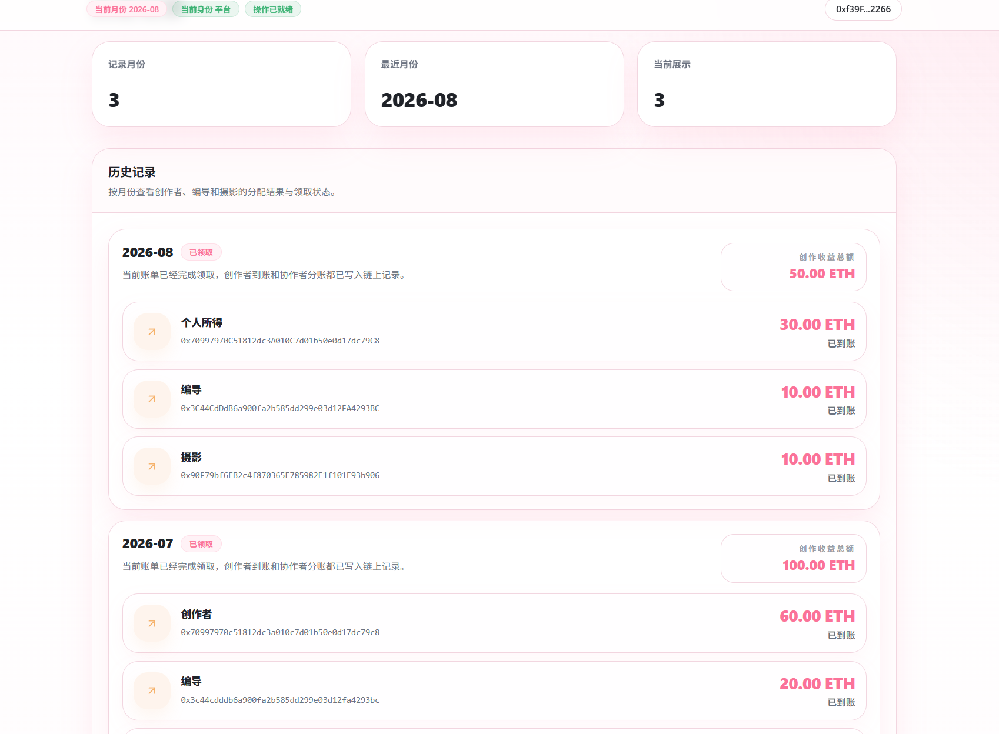
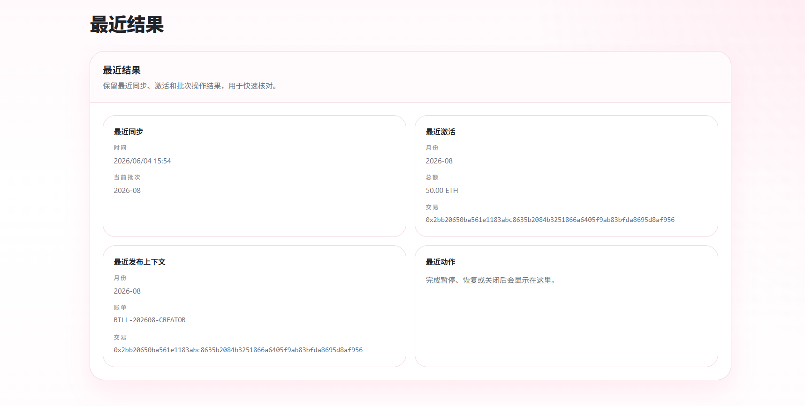
### 平台方与创作方发生纠纷时，平台方该月度状态的控制
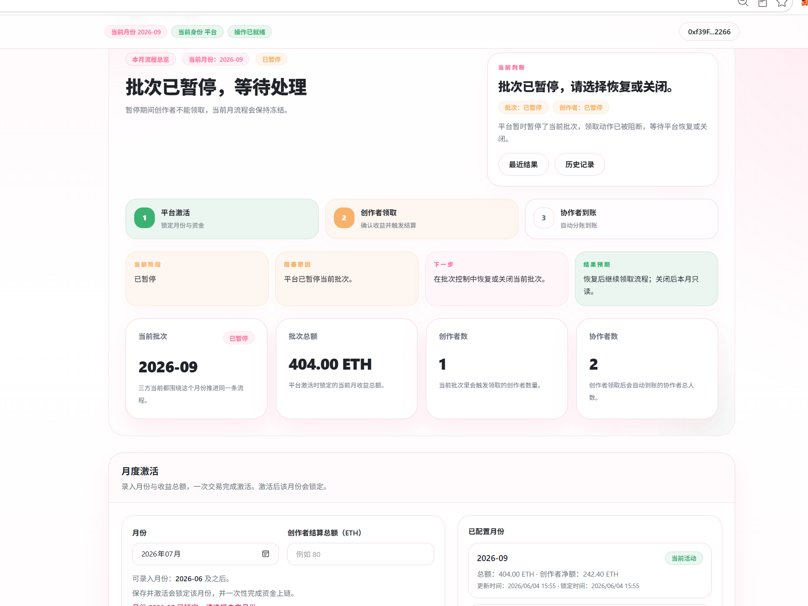
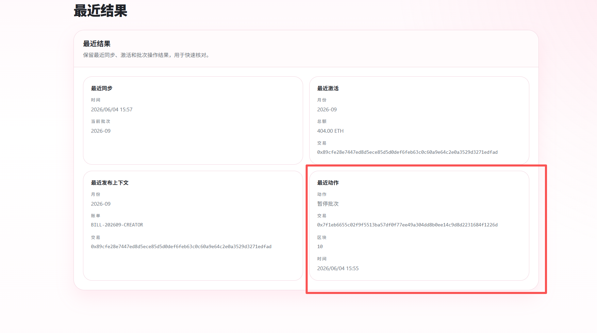
### 如果关闭当月的批次，那么平台方当月的发放会进入黑洞合约
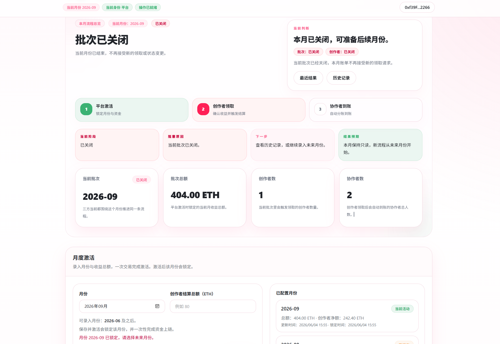


### 一键开发

```bash
cd blockchain-revenue-distribution-center
make dev
```

